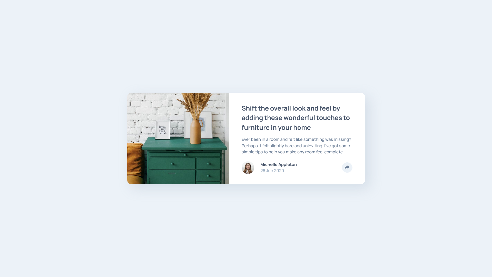

# Frontend Mentor - Article Preview Component Solution

This is a solution to the [Article Preview Component Challenge on Frontend Mentor](https://www.frontendmentor.io/challenges/article-preview-component-dYBN_pYFT). Frontend Mentor challenges help you improve your coding skills by building realistic projects. 

## Table of contents

- [Overview](#overview)
  - [The challenge](#the-challenge)
  - [Screenshot](#screenshot)
  - [Links](#links)
- [My process](#my-process)
  - [Built with](#built-with)
  - [What I learned](#what-i-learned)
  - [Continued development](#continued-development)
  - [Useful resources](#useful-resources)

## Overview

### The challenge

Users should be able to:

- View the optimal layout for the component depending on their device's screen size
- See the social media share links when they click the share icon

### Screenshot

### Links

- [Solution](https://www.frontendmentor.io/solutions/responsive-article-preview-component-using-css-grid-flex-and-js-5AZeExKx-r)
- [Live Site](https://fanciful-marzipan-930352.netlify.app/)

## My process

### Built with

- Semantic HTML5 markup
- CSS custom properties
- CSS Flexbox
- CSS Grid
- Mobile-first workflow

### What I learned

How to change the colour (`fill = "..."`) of an SVG object. This took time to figure out since I attempted this using CSS first, and when it did not work I put my googlefu skills to use and found a StackOverflow solution! How I set up the HTML doc also played a vital part in getting this to work just right, so yes this was the most time consuming part of this challenge.

### Continued development

SVGs. More SVGs. I'm starting to sound like a broken record LMAO

### Useful resources

- [Changing a SVG's Colour using JS](https://stackoverflow.com/questions/9872947/changing-svg-image-color-with-javascript) - Helped me configure the share icon to change colour when toggled and hovered over.
- [CSS Triangles](https://css-tricks.com/snippets/css/css-triangle/) - I used to this to make the little tooltip arrow!